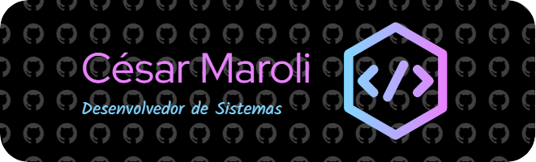

  

------------------------------------------------------------------------------------------------------------------------------------------------------------------

# 💫 Sobre Mim:
😎César de Almeida Maroli 👶22/01/2007 👨‍💻Cursando Desenvolvimento de Sistemas - Ensino Médio 🏫Escola Senai 🚩São José - SC 🗣Inglês Intermediário 🎶Gosto de ouvir música 🧠Rápida aprendizagem

## 🌐 Sociais:
   

# 💻 Ferramentas:
        	  
# 📊 GitHub Stats:
 
 

---

<!-- Proudly created with GPRM ( https://gprm.itsvg.in ) -->
